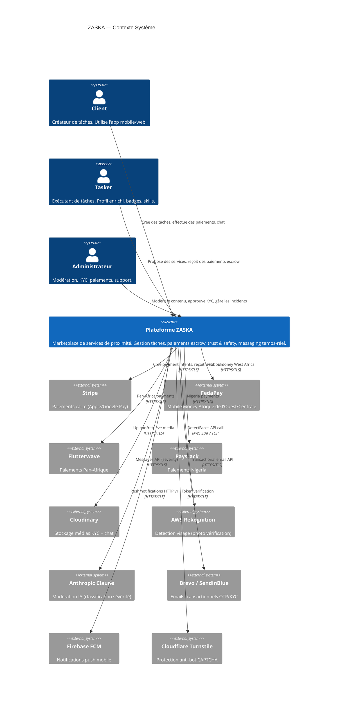
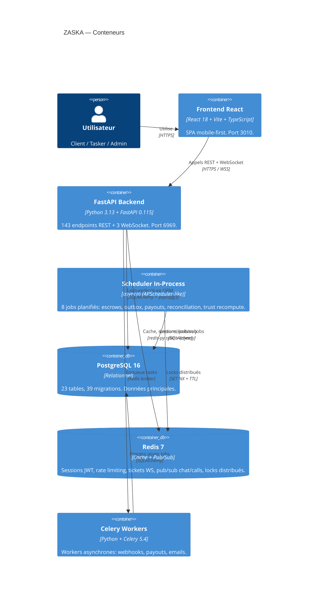
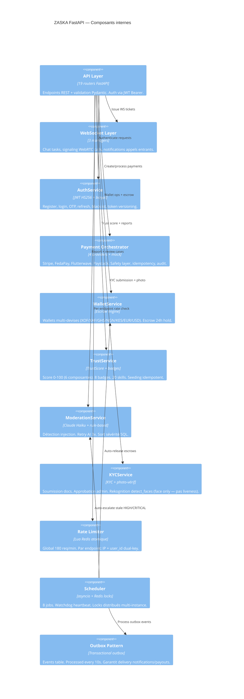

# ZASKA — Architecture C4 Model
> Generated: 2026-05-31 | Source: Code inspection of 143 endpoints, 23 tables, 39 migrations

---

## Niveau 1 — Contexte système



---

## Niveau 2 — Conteneurs



---

## Niveau 3 — Composants (FastAPI Backend)



---

## Flux de données critiques

### Flux paiement (escrow)

```
Client → POST /payments/create-intent
  → SafetyLayer (limits + fraud checks)
  → PaymentOrchestrator (provider selection par pays)
  → Provider externe (Stripe/FedaPay/etc.)
  ← Webhook provider → POST /payments/webhook/{provider}
    → Vérification signature HMAC
    → WalletService.fund_escrow()
    → OutboxEvent(type="escrow_funded")
    → Scheduler: release après 24h hold
```

### Flux modération

```
User → POST /trust/report
  → endpoint_rate_limit (5/300s IP + user_id)
  → ModerationService.report_content_sync() [rule-based, immediate]
  → BackgroundTask: ModerationService.enrich_with_ai()
    → _sanitize_for_prompt() [injection filtering]
    → _ai_severity() [Claude Haiku, retry 3x]
    → _ai_analysis() [Claude Haiku, retry 3x]
    → DB update case
  ← Admin: GET /moderation/cases [sorted CRITICAL→LOW]
```

### Flux WebSocket chat

```
User → POST /chat/{task_id}/ws-ticket
  → Redis SET ticket TTL 60s
  ← ticket (UUID)
User → WS /ws/tasks/{task_id}
  → auth message {type:"auth", ticket:"..."}
  → consume_ws_ticket() [one-time use, bound to task_id]
  → join room (max 50 connections)
  → messages via Redis pub/sub task-chat:{task_id}
  → fan-out cross-instance
```

---

## Inventaire des endpoints (143 total)

| Router | Endpoints | Auth | Rate Limited |
|--------|-----------|------|-------------|
| `/system` | 3 | No | Global only |
| `/auth` | 11 | Mixed | Yes (login/register/OTP) |
| `/users` | 4 | JWT | Global only |
| `/tasks` | 23 | JWT | Global only |
| `/payments` | 12 | Mixed | Partial |
| `/chat` | 4 | JWT | Global only |
| `/calls` | 5 | JWT | Global only |
| `/wallet` | 16 | JWT | Partial |
| `/feature-flags` | 2 | Mixed | Global only |
| `/kyc` | 6 | Mixed | Partial (photo: 3/hr) |
| `/admin` | 49 | Admin | Global only |
| `/trust` | 9 | Mixed | Yes (report: 5/5min) |
| `/moderation` | 6 | Admin | Global only |
| `/cards` | 3 | JWT | Global only |
| `/fx` | 2 | No | Global only |
| `/addresses` | 4 | JWT | Global only |
| `/statement` | 1 | JWT | Global only |
| `/notifications` | 4 | JWT | Global only |
| `/health` | 7 | No | None |

---

## Cartographie Redis (bases et usages)

| DB | Usage | Clés | TTL |
|----|-------|------|-----|
| 0 | Sessions + app | `blacklist:{token}`, `rl:*`, `ws_ticket:*`, `otp:*`, `fx:*`, `lock:*` | Varies |
| 1 | Celery broker | Celery task queue | Auto |
| 2 | Celery results | Celery result cache | Auto |

**Patterns de clés Redis (DB 0) :**
```
blacklist:{jwt_token}           → Token révoqué (logout/admin)
rl:http:{ip}:{window}           → Global rate limit
rl:ep:{prefix}:{ip}:{window}    → Endpoint rate limit (IP)
rl:ep:{prefix}:uid:{uid}:{win}  → Endpoint rate limit (user)
ws_ticket:{uuid}                → WebSocket ticket (TTL 60s)
otp:{phone_or_email}            → OTP code (TTL 5min)
fx:exposure:{XOF→USD}           → FX exposure tracker
lock:{job_name}                 → Distributed job lock (SET NX)
ver:{user_id}                   → Token version (password reset)
```

---

## Cartographie bases de données

### Tables principales (23+)

| Table | Rôle | Lignes estimées |
|-------|------|----------------|
| `users` | Comptes utilisateurs | Medium (10k-1M) |
| `tasks` | Tâches marketplace | High (100k+) |
| `wallets` | Wallets par devise | ~2× users |
| `transactions` | Ledger immuable | Very high |
| `escrows` | Fonds en séquestre | ~1× tasks |
| `kyc_submissions` | Dossiers KYC | ~users |
| `trust_scores` | Scores de confiance | ~users |
| `moderation_cases` | Cas de modération | Medium |
| `outbox_events` | Event sourcing | High (processed quickly) |
| `audit_logs` | Journal financier | Very high (append-only) |

### Index critiques
- `users.phone` UNIQUE INDEX
- `users.email` UNIQUE INDEX
- `tasks.status` INDEX
- `tasks.status, created_by` composite INDEX
- `transactions.wallet_id, created_at` composite INDEX
- `escrows.task_id` INDEX

---

## Cartographie services externes

| Service | Criticité | Fallback | Authentification |
|---------|-----------|----------|-----------------|
| PostgreSQL | **CRITIQUE** | Aucun | Connection string |
| Redis | **CRITIQUE** | Fail-open (rate limit) | URL (auth optionnel) |
| Stripe | Haute | FedaPay/Flutterwave | sk_live_ key |
| FedaPay | Haute | Flutterwave/mock | API key |
| Cloudinary | Haute | Upload échoue (503) | API key + secret |
| Brevo | Moyenne | Log only | API key |
| FCM | Moyenne | Log only | Service account JSON |
| AWS Rekognition | Basse | Mock auto-approve | Access key + secret |
| Anthropic | Basse | Rule-based fallback | API key |
| Turnstile | Basse | Bypass en dev | Secret key |
