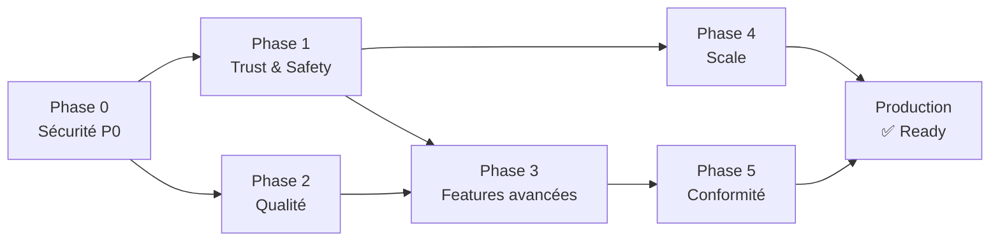

# ZASKA — Plan directeur d'évolution (Étape 8)
> Generated: 2026-05-31 | Basé sur les audits 2-7

---

## Principes directeurs

1. **Sécurité avant features** : P0/P1 sécurité avant tout développement non-critique
2. **Test coverage = filet de sécurité** : atteindre 80% avant Étape 9
3. **Conformité RGPD** : endpoint suppression avant mise en production Europe
4. **Trust & Safety** : liveness réelle avant expansion marché

---

## Roadmap par phase

### PHASE 0 — Stabilisation (2 semaines) [BLOQUANT]

**Sécurité critique (P0)**
| Tâche | Effort | Impact | Priorité |
|-------|--------|--------|----------|
| Migrer python-jose → PyJWT (SEC-001) | 2h | CRITIQUE | P0 |
| Webhook pre-check idempotency (SEC-002) | 4h | CRITIQUE | P0 |
| Rate limit OTP par email (SEC-003) | 1h | ÉLEVÉ | P0 |
| OTP secret séparé (SEC-006) | 1h | ÉLEVÉ | P0 |
| require_admin() check suspension (SEC-004) | 30min | ÉLEVÉ | P0 |
| Upgrade python-multipart >= 0.0.18 (SEC-005) | 15min | ÉLEVÉ | P0 |
| Exécuter migration 0039 (C-08) | 1h | BLOQUANT | P0 |
| Tester Sentinel failover (C-01) | 2h | ÉLEVÉ | P0 |

**Opérationnel**
| Tâche | Effort | Impact | Priorité |
|-------|--------|--------|----------|
| Définir politique rétention données | 4h | RGPD | P0 |
| Endpoint suppression compte (RGPD Art.17) | 8h | RGPD | P0 |
| Consentement biométrique explicit (KYC) | 2h | RGPD | P0 |

---

### PHASE 1 — Infrastructure Trust & Safety (3 semaines)

| Tâche | Effort | Dépendances | Livrable |
|-------|--------|-------------|---------|
| Face Liveness (AWS FaceLiveness SDK) | 3j | AWS account | C-04 résolu |
| Device fingerprinting (X-Device-ID) | 2j | — | Multi-compte détection |
| Advanced Trust Score (decay + plus de composantes) | 2j | Étape 9 | Score fiable |
| Public user history endpoint | 1j | — | Profils riches |
| Indexes DB manquants (escrow.status, etc.) | 2h | — | Perf +30% |
| CI/CD GitHub Actions (test + security scan) | 4h | — | DevSecOps |

---

### PHASE 2 — Qualité & Coverage (2 semaines)

| Tâche | Effort | Objectif |
|-------|--------|---------|
| Tests wallet_service (escrow, transfer, limits) | 3j | +15% coverage |
| Tests payment_service (webhooks, intents) | 3j | +15% coverage |
| Tests auth_service (register, login, OTP) | 2j | +10% coverage |
| Tests API endpoints (tasks, admin) | 2j | +10% coverage |
| **Objectif total : 80% coverage** | | |

---

### PHASE 3 — Features avancées Trust (4 semaines)

| Feature | Effort | Description |
|---------|--------|-------------|
| Profils enrichis complets | 3j | Bio, skills, histoire, réputation affichée |
| Détection multi-comptes avancée | 5j | IP graph, device graph, behavioral analysis |
| Anti-fraude avancé | 5j | Velocity checks, network analysis |
| Modération intelligente v2 | 3j | NLP chat, détection off-platform |
| Vérification vocale | 5j | Audio liveness ou voiceprint |

---

### PHASE 4 — Scale & Performance (2 semaines)

| Tâche | Effort | Impact |
|-------|--------|--------|
| PgBouncer en production | 2j | 1000+ users |
| Partitioning audit_logs par mois | 1j | Perf long terme |
| Redis Sentinel opérationnel | 1j | HA Redis |
| Cache FX rates agressif | 1j | Réduction latence |
| N+1 fix tasks listing | 1j | Perf GET /tasks |

---

### PHASE 5 — Conformité (1 mois)

| Tâche | Effort | Réglementation |
|-------|--------|----------------|
| Export données complet | 3j | RGPD Art.20 |
| Purge automatique données expirées | 2j | RGPD Art.17 |
| Chiffrement backups GPG | 1j | Bonnes pratiques |
| Privacy Impact Assessment biométrie | 5j | RGPD Art.35 |
| Politique confidentialité + CGU | 3j | RGPD Art.13 |

---

## Estimation globale

| Phase | Durée | Équipe | Priorité |
|-------|-------|--------|---------|
| Phase 0 (Stabilisation) | 2 semaines | 1 dev senior | BLOQUANT |
| Phase 1 (Trust & Safety) | 3 semaines | 2 devs | HAUTE |
| Phase 2 (Qualité) | 2 semaines | 1 dev | HAUTE |
| Phase 3 (Features avancées) | 4 semaines | 2 devs | MOYENNE |
| Phase 4 (Scale) | 2 semaines | 1 dev + infra | MOYENNE |
| Phase 5 (Conformité) | 4 semaines | 1 dev + legal | HAUTE |

**Total : ~17 semaines (4 mois) pour plateforme production-grade complète**

---

## Dépendances critiques

---

## Métriques de succès

| Métrique | Actuel | Cible Phase 0 | Cible Phase 3 |
|----------|--------|---------------|---------------|
| Security score | 58/100 | 80/100 | 90/100 |
| Test coverage | <15% | 50% | 80% |
| Trust & Safety score | 48/100 | 65/100 | 85/100 |
| RGPD compliance | 45/100 | 70/100 | 90/100 |
| Performance (p95 latency) | ~500ms | ~300ms | ~200ms |
| Availabilty SLA | 95% | 99% | 99.9% |
